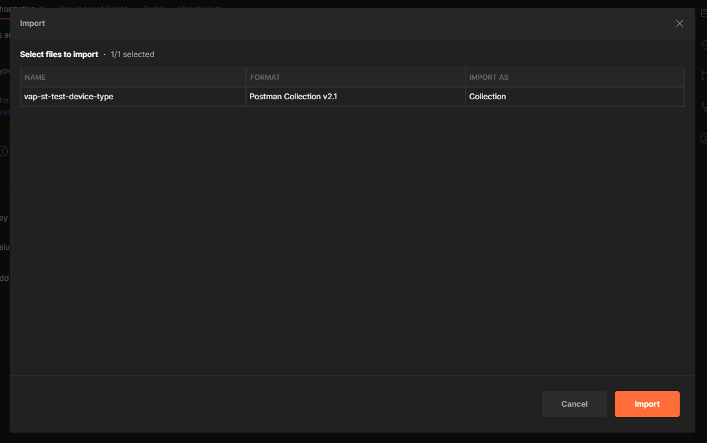
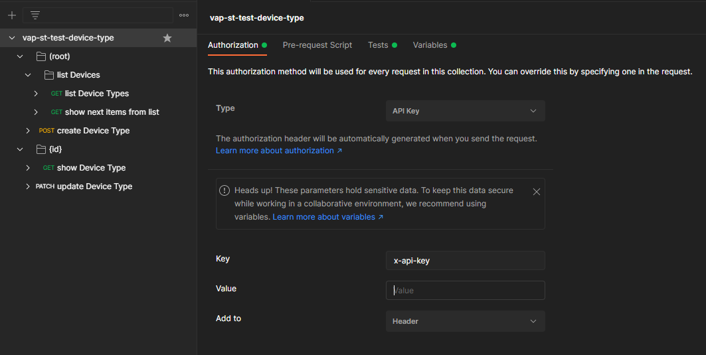
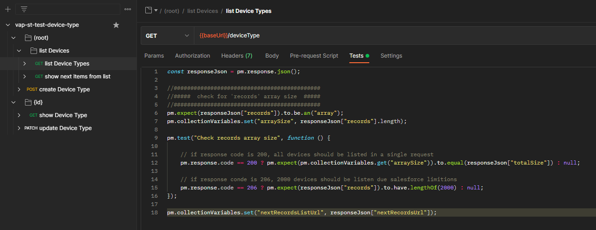
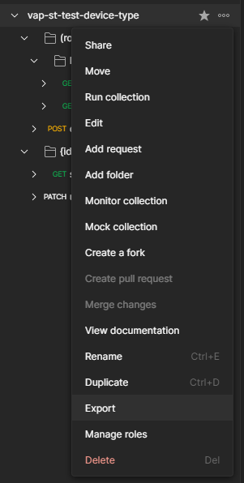

#

# Postman

## Install Postman

- [Mac](https://learning.postman.com/docs/getting-started/installation-and-updates/#installing-postman-on-mac)
- [Windows](https://learning.postman.com/docs/getting-started/installation-and-updates/#installing-postman-on-windows)
- [Linux](https://learning.postman.com/docs/getting-started/installation-and-updates/#installing-postman-on-linux)

#

## Importing collection to Postman

> Go to `File` -> `Import` -> `Upload Files` -> Choose the `.json` file of the desired collection -> `Import`



> In order to send any request or run any test it is required to configure the API Key on Postman at the API root folder -> `Authorization` -> `Value`.



#

## Create Test

> [Writing tests](https://learning.postman.com/docs/writing-scripts/test-scripts/) -> Link to offcial Postman documentation.

- Each `folder` or `request` has a tab `Tests` to create all the tests to run on.
- Creating a test on `folders` makes all lower levels to run the those tests.
- Tests will run automatically on each sent request, even the higher level ones.
- Higher level tests will always run first.
- All the tests are written in NodeJS Code.
- Postman uses [Chai](https://www.chaijs.com/api/bdd/) to test conditions.
- Tests are seperated by each `pm.test()` functions.
- Tests are interrupted on first failure condition on each test.

Example of a test to check if HTTP Status is `200`:

```javascript
pm.test("HTTP status code is 200", function () {
  pm.response.to.have.status(200);
});
```

### Some usefull links to help create tests

- [Postman Answers - Workspace](https://www.postman.com/postman/workspace/postman-answers)
- [Learning Postman - Writing scripts - Intro to scripts](https://learning.postman.com/docs/writing-scripts/intro-to-scripts/)
- [Learning Postman - Writing scripts - Pre request scripts](https://learning.postman.com/docs/writing-scripts/pre-request-scripts/)
- [Learning Postman - Writing scripts - Test scripts](https://learning.postman.com/docs/writing-scripts/test-scripts/)
- [Learning Postman - Writing scripts - Script references - Test examples](https://learning.postman.com/docs/writing-scripts/script-references/test-examples/)
- [Learning Postman - Writing scripts - Script references - Variables list](https://learning.postman.com/docs/writing-scripts/script-references/variables-list/)
- [Learning Postman - Writing scripts - Script references - JavaScript Reference](https://learning.postman.com/docs/writing-scripts/script-references/postman-sandbox-api-reference/)



#

## Saving Collection

### Export Collection

> At the API root folder on Postman, go to `...` -> `Export` -> `Export` -> Choose location -> `Save`



> In order to run these tests in CI/CD pipeline, all the `*.json` collections must be inside the folder:

```
  <vap-st-connector repository>/tests/E2E/collections
```

#

# Run newman script locally

## Install NodeJS

- [Official Download Website](https://nodejs.org/en/download/)

## Install node modules

> Inside the folder `tests/E2E` of `vap-st-conector` repository open the terminal and run:

```console
 $ npm install
```

> This will install all the required modules to run this script

> After the installation all it's needed is run the script with the following command on the same folder:

```console
 $ node index.js
```

#

# API Reference

## Newman run

```js
newman.run(options: _object_ , callback: _function_) => run: EventEmitter
```

> The `run` function executes a collection and returns the run result to a callback function provided as parameter.

> The return of the `newman.run` function is a run instance, which emits run events that can be listened to.

| Parameter                   | Description                                                                                                                                                                                                                                                                                                                                                                                                                                                                                                                                                                                                                                                                                                                              |
| --------------------------- | ---------------------------------------------------------------------------------------------------------------------------------------------------------------------------------------------------------------------------------------------------------------------------------------------------------------------------------------------------------------------------------------------------------------------------------------------------------------------------------------------------------------------------------------------------------------------------------------------------------------------------------------------------------------------------------------------------------------------------------------- |
| options                     | This is a required argument and it contains all information pertaining to running a collection.<br /><br />_Required_<br />Type: `object`                                                                                                                                                                                                                                                                                                                                                                                                                                                                                                                                                                                                |
| options.collection          | The collection is a required property of the `options` argument. It accepts an object representation of a Postman Collection which should resemble the schema mentioned at [https://schema.getpostman.com/](https://schema.getpostman.com/). The value of this property could also be an instance of Collection Object from the [Postman Collection SDK](https://github.com/postmanlabs/postman-collection).<br /><br />As `string`, one can provide a URL where the Collection JSON can be found (e.g. [Postman Cloud API](https://api.getpostman.com/) service) or path to a local JSON file.<br /><br />_Required_<br />Type: `object\|string` [PostmanCollection](https://github.com/postmanlabs/postman-collection/wiki#Collection) |
| options.environment         | One can optionally pass an environment file path or URL as `string` to this property and that will be used to read Postman Environment Variables from. This property also accepts environment variables as an `object`. Environment files exported from Postman App can be directly used here.<br /><br />_Optional_<br />Type: `object\|string`                                                                                                                                                                                                                                                                                                                                                                                         |
| options.envVar              | One can optionally pass environment variables as an array of key-value string object pairs. It will be used to read Postman Environment Variables as well as overwrite environment variables from `options.environments`. <br /><br />_Optional_<br />Type: `array\|object`                                                                                                                                                                                                                                                                                                                                                                                                                                                              |
| options.globals             | Postman Global Variables can be optionally passed on to a collection run in form of path to a file or URL. It also accepts variables as an `object`.<br /><br />_Optional_<br />Type: `object\|string`                                                                                                                                                                                                                                                                                                                                                                                                                                                                                                                                   |
| options.globalVar           | One can optionally pass global environment variables as an array of key-value string object pairs. It will be used to read Postman Global Environment Variables as well as overwrite global environment variables from `options.globals`. <br /><br />_Optional_<br />Type: `array\|object`                                                                                                                                                                                                                                                                                                                                                                                                                                              |
| options.iterationCount      | Specify the number of iterations to run on the collection. This is usually accompanied by providing a data file reference as `options.iterationData`.<br /><br />_Optional_<br />Type: `number`, Default value: `1`                                                                                                                                                                                                                                                                                                                                                                                                                                                                                                                      |
| options.iterationData       | Path to the JSON or CSV file or URL to be used as data source when running multiple iterations on a collection.<br /><br />_Optional_<br />Type: `string`                                                                                                                                                                                                                                                                                                                                                                                                                                                                                                                                                                                |
| options.folder              | The name or ID of the folder/folders (ItemGroup) in the collection which would be run instead of the entire collection.<br /><br />_Optional_<br />Type: `string\|array`                                                                                                                                                                                                                                                                                                                                                                                                                                                                                                                                                                 |
| options.workingDir          | The path of the directory to be used as working directory.<br /><br />_Optional_<br />Type: `string`, Default value: `Current Directory`                                                                                                                                                                                                                                                                                                                                                                                                                                                                                                                                                                                                 |
| options.insecureFileRead    | Allow reading files outside of working directory.<br /><br />_Optional_<br />Type: `boolean`, Default value: `true`                                                                                                                                                                                                                                                                                                                                                                                                                                                                                                                                                                                                                      |
| options.timeout             | Specify the time (in milliseconds) to wait for the entire collection run to complete execution.<br /><br />_Optional_<br />Type: `number`, Default value: `Infinity`                                                                                                                                                                                                                                                                                                                                                                                                                                                                                                                                                                     |
| options.timeoutRequest      | Specify the time (in milliseconds) to wait for requests to return a response.<br /><br />_Optional_<br />Type: `number`, Default value: `Infinity`                                                                                                                                                                                                                                                                                                                                                                                                                                                                                                                                                                                       |
| options.timeoutScript       | Specify the time (in milliseconds) to wait for scripts to return a response.<br /><br />_Optional_<br />Type: `number`, Default value: `Infinity`                                                                                                                                                                                                                                                                                                                                                                                                                                                                                                                                                                                        |
| options.delayRequest        | Specify the time (in milliseconds) to wait for between subsequent requests.<br /><br />_Optional_<br />Type: `number`, Default value: `0`                                                                                                                                                                                                                                                                                                                                                                                                                                                                                                                                                                                                |
| options.ignoreRedirects     | This specifies whether newman would automatically follow 3xx responses from servers.<br /><br />_Optional_<br />Type: `boolean`, Default value: `false`                                                                                                                                                                                                                                                                                                                                                                                                                                                                                                                                                                                  |
| options.insecure            | Disables SSL verification checks and allows self-signed SSL certificates.<br /><br />_Optional_<br />Type: `boolean`, Default value: `false`                                                                                                                                                                                                                                                                                                                                                                                                                                                                                                                                                                                             |
| options.bail                | A switch to specify whether or not to gracefully stop a collection run (after completing the current test script) on encountering the first error. Takes additional modifiers as arguments to specify whether to end the run with an error for invalid name or path.<br /><br/>Available modifiers: `folder` and `failure`.<br />eg. `bail : ['folder']`<br /><br />_Optional_<br />Type: `boolean\|object`, Default value: `false`                                                                                                                                                                                                                                                                                                      |
| options.suppressExitCode    | If present, allows overriding the default exit code from the current collection run, useful for bypassing collection result failures. Takes no arguments.<br /><br />_Optional_<br />Type: `boolean`, Default value: `false`                                                                                                                                                                                                                                                                                                                                                                                                                                                                                                             |
| options.reporters           | Specify one reporter name as `string` or provide more than one reporter name as an `array`.<br /><br />Available reporters: `cli`, `json`, `junit`, `progress` and `emojitrain`.<br /><br />_Optional_<br />Type: `string\|array`                                                                                                                                                                                                                                                                                                                                                                                                                                                                                                        |
| options.reporter            | Specify options for the reporter(s) declared in `options.reporters`. <br /> e.g. `reporter : { junit : { export : './xmlResults.xml' } }` <br /> e.g. `reporter : { html : { export : './htmlResults.html', template: './customTemplate.hbs' } }` <br /><br />_Optional_<br />Type: `object`                                                                                                                                                                                                                                                                                                                                                                                                                                             |
| options.color               | Enable or Disable colored CLI output.<br/><br/>Available options: `on`, `off` and `auto`<br /><br />_Optional_<br />Type: `string`, Default value: `auto`                                                                                                                                                                                                                                                                                                                                                                                                                                                                                                                                                                                |
| options.sslClientCert       | The path to the public client certificate file.<br /><br />_Optional_<br />Type: `string`                                                                                                                                                                                                                                                                                                                                                                                                                                                                                                                                                                                                                                                |
| options.sslClientKey        | The path to the private client key file.<br /><br />_Optional_<br />Type: `string`                                                                                                                                                                                                                                                                                                                                                                                                                                                                                                                                                                                                                                                       |
| options.sslClientPassphrase | The secret client key passphrase.<br /><br />_Optional_<br />Type: `string`                                                                                                                                                                                                                                                                                                                                                                                                                                                                                                                                                                                                                                                              |
| options.sslClientCertList   | The path to the client certificate configuration list file. This option takes precedence over `sslClientCert`, `sslClientKey` and `sslClientPassphrase`. When there is no match in this configuration list, `sslClientCert` is used as fallback.<br /><br />_Optional_<br />Type: `string\|array`                                                                                                                                                                                                                                                                                                                                                                                                                                        |
| options.sslExtraCaCerts     | The path to the file, that holds one or more trusted CA certificates in PEM format.<br /><br />_Optional_<br />Type: `string`                                                                                                                                                                                                                                                                                                                                                                                                                                                                                                                                                                                                            |
| options.requestAgents       | Specify the custom requesting agents to be used when performing HTTP and HTTPS requests respectively. Example: [Using Socks Proxy](#using-socks-proxy)<br /><br />_Optional_<br />Type: `object`                                                                                                                                                                                                                                                                                                                                                                                                                                                                                                                                         |
| options.cookieJar           | One can optionally pass a CookieJar file path as `string` to this property and that will be deserialized using [`tough-cookie`](https://github.com/salesforce/tough-cookie). This property also accepts a `tough-cookie` CookieJar instance.<br /><br />_Optional_<br />Type: `object\|string`                                                                                                                                                                                                                                                                                                                                                                                                                                           |
| options.newmanVersion       | The Newman version used for the collection run.<br /><br />_This will be set by Newman_                                                                                                                                                                                                                                                                                                                                                                                                                                                                                                                                                                                                                                                  |
| callback                    | Upon completion of the run, this callback is executed with the `error`, `summary` argument.<br /><br />_Required_<br />Type: `function`                                                                                                                                                                                                                                                                                                                                                                                                                                                                                                                                                                                                  |

#

## Newman callback

```js
newman.run~callback(error: object , summary: object)
```

> The `callback` parameter of the `newman.run` function receives two arguments: (1) `error` and (2) `summary`

| Argument               | Description                                                                                                                                                                                                                                                                                                                                                                                                                                                                                            |
| ---------------------- | ------------------------------------------------------------------------------------------------------------------------------------------------------------------------------------------------------------------------------------------------------------------------------------------------------------------------------------------------------------------------------------------------------------------------------------------------------------------------------------------------------ |
| error                  | In case newman faces an error during the run, the error is passed on to this argument of callback. By default, only fatal errors, such as the ones caused by any fault inside Newman is passed on to this argument. However, setting `abortOnError:true` or `abortOnFailure:true` as part of run options will cause newman to treat collection script syntax errors and test failures as fatal errors and be passed down here while stopping the run abruptly at that point.<br /><br />Type: `object` |
| summary                | The run summary will contain information pertaining to the run.<br /><br />Type: `object`                                                                                                                                                                                                                                                                                                                                                                                                              |
| summary.error          | An error object which if exists, contains an error message describing the message <br /><br />Type: `object`                                                                                                                                                                                                                                                                                                                                                                                           |
| summary.collection     | This object contains information about the collection being run, it's requests, and their associated pre-request scripts and tests.<br /><br />Type: `object`                                                                                                                                                                                                                                                                                                                                          |
| summary.environment    | An object with environment variables used for the current run, and the usage status for each of those variables.<br /><br />Type: `object`                                                                                                                                                                                                                                                                                                                                                             |
| summary.globals        | This object holds details about the globals used within the collection run namespace.<br /><br />Type: `object`                                                                                                                                                                                                                                                                                                                                                                                        |
| summary.run            | A cumulative run summary object that provides information on .<br /><br />Type: `object`                                                                                                                                                                                                                                                                                                                                                                                                               |
| summary.run.stats      | An object which provides details about the total, failed, and pending counts for pre request scripts, tests, assertions, requests, and more.<br /><br />Type: `object`                                                                                                                                                                                                                                                                                                                                 |
| summary.run.failures   | An array of failure objects, with each element holding details, including the assertion that failed, and the request.<br /><br />Type: `array.<object>`                                                                                                                                                                                                                                                                                                                                                |
| summary.run.executions | This object contains information about each request, along with it's associated activities within the scope of the current collection run.<br /><br />Type: `array.<object>`                                                                                                                                                                                                                                                                                                                           |

#

## Newman events

```js
newman.run~events
```

> Newman triggers a whole bunch of events during the run.

> All events receive two arguments (1) `error` and (2) `args`. \*\*The list below describes the properties of the second
> argument object.

| Event            | Description                                                                                |
| ---------------- | ------------------------------------------------------------------------------------------ |
| start            | The start of a collection run                                                              |
| beforeIteration  | Before an iteration commences                                                              |
| beforeItem       | Before an item execution begins (the set of prerequest->request->test)                     |
| beforePrerequest | Before `prerequest` script is execution starts                                             |
| prerequest       | After `prerequest` script execution completes                                              |
| beforeRequest    | Before an HTTP request is sent                                                             |
| request          | After response of the request is received                                                  |
| beforeTest       | Before `test` script is execution starts                                                   |
| test             | After `test` script execution completes                                                    |
| beforeScript     | Before any script (of type `test` or `prerequest`) is executed                             |
| script           | After any script (of type `test` or `prerequest`) is executed                              |
| item             | When an item (the whole set of prerequest->request->test) completes                        |
| iteration        | After an iteration completes                                                               |
| assertion        | This event is triggered for every test assertion done within `test` scripts                |
| console          | Every time a `console` function is called from within any script, this event is propagated |
| exception        | When any asynchronous error happen in `scripts` this event is triggered                    |
| beforeDone       | An event that is triggered prior to the completion of the run                              |
| done             | This event is emitted when a collection run has completed, with or without errors          |

### Example

```javascript
newman
  .run({
    collection: require("./sample-collection.json"),
  })
  .on("start", function (err, args) {
    // on start of run, log to console
    console.log("running a collection...");
  })
  .on("done", function (err, summary) {
    if (err || summary.error) {
      console.error("collection run encountered an error.");
    } else {
      console.log("collection run completed.");
    }
  });
```

#

# NEWMAN CLI

## Install

> It is required [NodeJS](https://nodejs.org/en/download/) in order to install/run newman

```shell
$ npm install -g newman
```

#

## Usage

> Runs on a bash/shell terminal

```shell
$ newman run examples/sample-collection.json
```

#

## Status code

- Newman, by default, exits with a status code of 0 if everything runs well, such as without any exceptions.

- You can use the `--bail` flag to tell Newman to halt on a test case error with a status code of 1, which can then be picked up by a CI tool or build system.

- You can use `-x` or `--suppress-exit-code` to override the default exit code for the current run

```shell
$ newman run PostmanCollection.json -e environment.json --bail
```

#

## Reporters

> Reporters provide information about the current collection run in a format that is easy to both: disseminate and assimilate. Reporters can be configured using the -r or --reporters options. Inbuilt reporters in newman are: cli, json, junit, progress and emojitrain.

### CLI Reporter

| CLI Option                       | Description                                                                                                                                                                                                                                                                                                                      |
| -------------------------------- | -------------------------------------------------------------------------------------------------------------------------------------------------------------------------------------------------------------------------------------------------------------------------------------------------------------------------------- |
| `--reporter-cli-silent`          | The CLI reporter is internally disabled and you see no output to terminal.                                                                                                                                                                                                                                                       |
| `--reporter-json-export <path>`  | Specify a path where the output JSON file will be written to disk. If not specified, the file will be written to newman/ in the current working directory. If the specified path does not exist, it will be created. However, if the specified path is a pre-existing directory, the report will be generated in that directory. |
| `--reporter-junit-export <path>` | Specify a path where the output XML file will be written to disk. If not specified, the file will be written to newman/ in the current working directory. If the specified path does not exist, it will be created. However, if the specified path is a pre-existing directory, the report will be generated in that directory.  |

#
